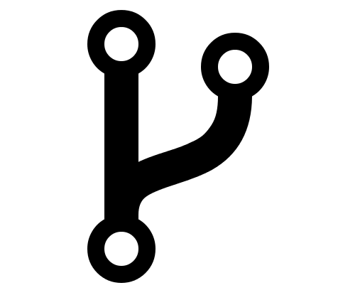
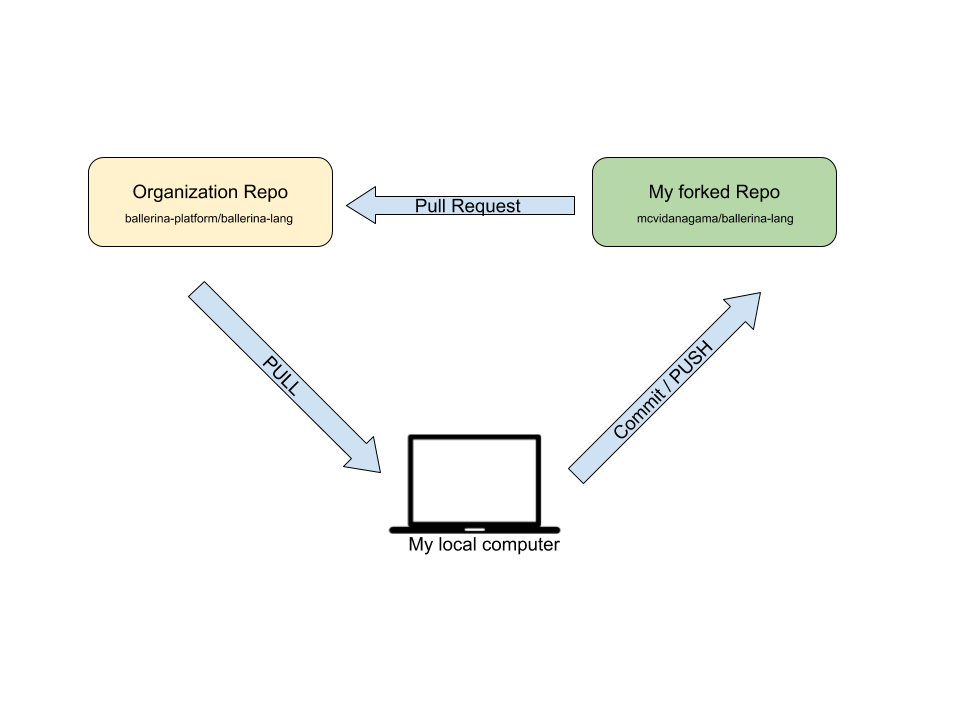
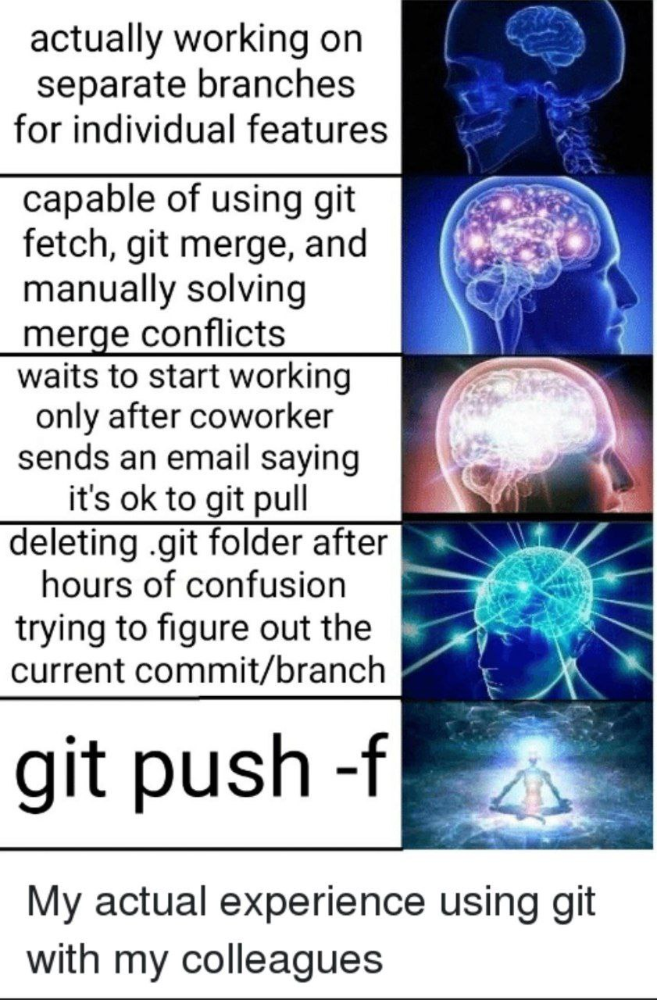

# Git!

> Git (/git/)[7] is a distributed version-control system for tracking changes in source code during software development.


**By Roozbeh Sharifnasab**
rsharifnasab@gmail.com

------------------

# Manual version control


------------------

# Problems

-   Save-as whole project
-   Collaboration
-   Last stable version
-   Space inefficiency
-   Tracking changes

------------------

# Benefits of version control

-   Manage collaboration on a project
-   Unlimited number of developers
-   Revert changes if something went wrong

------------------

# SVN (by Apache)


------------------

# Visual Studio Team Services code (by Microsoft)


------------------

# Git (by Linus Torvalds)


------------------

# As of 2020, the 5.6 release of the Linux kernel had around 33 million lines of code.


------------------

# Git features

-   Free and open source
-   Distributed
-   Non-linear history (branches)
-   Handle large projects efficiently


------------------


------------------


---------


------------------

# How to use Git


------------------


------


------------------

# Hands-on

+ Initialize Git
+ Write code
+ Add to staging, Commit
+ Status
+ Git log/checkout


------------------

# In-depth

+ Is Git **running** in the background?

-   What if we change a file twice?
-   What does **tracking** mean?
-   What if I uninstall git?
-   What about deleting `.git`?

------------------

# Best practices

+ I just wrote a line of code; should I commit? ([atomic commits](https://dev.to/paulinevos/atomic-commits-will-help-you-git-legit-35i7))
+ Should I commit on a timely basis?
+ What to write in the commit message?  ([conventional commit message](https://gist.github.com/qoomon/5dfcdf8eec66a051ecd85625518cfd13))

-----------------


------------------

# Branch

+ Working on a feature
+ Split different programmers' work
+ Do not mess up the main/master branch


----------


------------------


------------------

# Merge conflict

-   What if we can't merge?
-   Two developers changed the same file
-   Somebody should merge 2 versions
-   Merge-tool


------------------

# Git HEAD

+ Pointer to a commit
+ Current state of the working dir
+ Where are the other commits?


------------------

# Checkout

- Switch to another branch (prefer `switch`)

- Reset a file to a specific commit version


------------------

# Hands-on

+ Create another branch
+ Checkout to another branch
+ Add commits to different branches
+ Merge changes
+ Solve a merge conflict

------------------

# Branching best pratcies

- Topic branches
  - Avoid merging to master directly (PR & code review)
  - Keep master branch up-to-date and high quality


------------------

# Branching best pratcies

- Release branches
  - Stabilize a release of code
  - Long-lived
  - Lock after end of support
  - Do not merge to master
  - Port updates from master

- Read more [here](https://learn.microsoft.com/en-us/azure/devops/repos/git/git-branching-guidance?view=azure-devops)


------------------

# Branching best pratcies

- **Git flow**
  - Stable master branch
  - Feature branch
  - Hot-fix branch
  - Release branch
  - Development branch


------------------

# Branching best pratcies
- **Trunk-based**
  - DevOps friendly
  - merge small, frequent updates
  - core trunk = main branch

Read more [here](https://www.atlassian.com/continuous-delivery/continuous-integration/trunk-based-development)


------------------

# GitHub

- Instagram for git

- A place to keep git projects, review them, fork them, and star them.

- Alternatives: Gitlab, Bitbucket, and more


------------------

# Gist
+  A code snippet
+  It is not common
+  Nor big projects, nor small ones
+  like [a cheat sheet](https://gist.github.com/mayazdi/9c3fc4f6e9828a803be757d177cea8e1)


------------------

# Push? Remote? Clone?

-   remote: where should I upload my git projects
-   push: the act of uploading the git project
-   pull: check for updates in the remote git
-   clone: download the whole git project


------------------

# Fork



------------------

# Pull Request (PR)




------------------

# Hands-on

+ Want a review? [Check this](https://medium.com/hackernoon/a-gentle-introduction-to-git-and-github-the-eli5-way-43f0aa64f2e4)

+ A cheat sheet? [Check this](https://github.com/arslanbilal/git-cheat-sheet)


------------------

<!-- Issue -->


------------------

# .gitignore

- .git: git internal files
    - don't modify it!

- .gitignore: which files should be ignored by git?
```
*.class
node_modules/
__pycache__/
```

[gitignore.io](https://www.gitignore.io/)


-------------------

## File to ignore
+ Blob files
+ Auto-generated files
+ IDE-specific files
+ Assets?
+ Passwords?


------------------


# Tag

- Commits don't have a name
- How to specify commits
- Which commit was the last stable version?
- How to handle versions?

- Read more [here](https://www.atlassian.com/git/tutorials/inspecting-a-repository/git-tag)


------------------

# Fetch VS Pull

+ Pull = Fetch + merge
+ Just merge?
+ What if we don't merge


-----------------

# History
+ Once again, why are we controlling version?
+ What was my last version?
+ Who/When did this change?


------------------

# Revert

- Undo last commit changes

- With a brand-new commit


----------------

# Amend

Change latest commit
    - commit message
    - or even committed files


#rewrite_history

------------------

# Rebase

- Another way of merge
- Combine history by adding old commits
- Not suitable for juniors
- learn more [here](https://www.atlassian.com/git/tutorials/merging-vs-rebasing)
- Linear history


#rewrite_history

-----------------


------------------

# Interactive Rebase

- Select recent some commits to edit
- Squash
    - not a git command
    - a term in using rebase
    - group specific changes to one commit


------------------

# Force push

+ Don't re-write history
    + Published commits
    + Master branch


-----------------

# Force with lease push
+ Force push but safer
+ Check if is OK or not
+ In new git version


---

# Stash

- save uncommitted changes
- What to do for
    + uncommitted
    + ignored
    + staged


------------------

# Bisect


------------------

# Cherry-pick

- add other branch's commit to the current branch


------------------

# Conclusion

- Search & use help & read documentation
- Don't panic
- Test new commands in a toy repository
- Don't commit large files
- Don't re-write public history
- Pull before push, even better, pull before starting coding
- Aliasing for your useful command

--------------


------------------


-----------------



------------------

# further read

- [Interactive learning](https://learngitbranching.js.org/)
- [Amir's awesome slides](https://github.com/amirhallaji/My-Learning/tree/master/git)
- [perfect cheat sheet](https://github.com/arslanbilal/git-cheat-sheet)
- [this GitHub io page](https://rachelcarmena.github.io/2018/12/12/how-to-teach-git.html)
- [command by command, explain](https://recompilermag.com/issues/issue-1/how-to-teach-git/)
- [Jadi's videos](https://faradars.org/courses/fvgit9609-git-github-gitlab)
- [Roadmap](https://devopscube.com/git-for-devops/)
- [this good slide](https://courses.cs.washington.edu/courses/cse403/13au/lectures/git.ppt.pdf)
- [cheatsheet](https://www.pauline-vos.nl/git-legit-cheatsheet/)

------------------


# common commands

```bash
# first time initialize
git config --global user.name "Bugs Bunny"
git config --global user.email bugs@gmail.com
git init


# regulary code and commit
git status
git add -A # or git add filename
git commit -m 'commit message'
```

----------------

```bash
# work with remote
git remote add origin https://github.com/your-account/your-repository.git
git push origin master # push from master branch to origin remote
git pull # get new updates
git clone https://github.com/sb-acc/some-repo.git

# see old commits (and other beautiful versions of this command)
git log
git log --abbrev-commit --pretty=oneline
git log --graph --oneline --decorate --abbrev-commit

```

----------------

```bash
# work with history
git checkout branchname # change HEAD to another commit/branch
git reset --hard HEAD # revert to last commit
git diff HEAD # what is changed from head
git checkout HEAD filename # revert filename to last commit

git blame filename # who changed this file

```

----------------

```bash
# stash
git stash # save uncommited changes and revert repository to commited sate
git stash list
git stash pop # pop last saved stash


# tag
git tag tagname -am 'tag message' # create new tag
git tag # list all tags
git push --tags


```

----------------

```bash
# merge
git config --global merge.tool meld # meld or another app
git checkout destination
git merge source
git mergetool # open the merge tool

# get help
curl http:/cheat.sh/git
man git-add
info git-add


rm -rf .git # get rid of git!
```

------------------


made with [Marp](https://marp.app/)

+ run with:
```bash
marp README.md --allow-local-files -w
```
