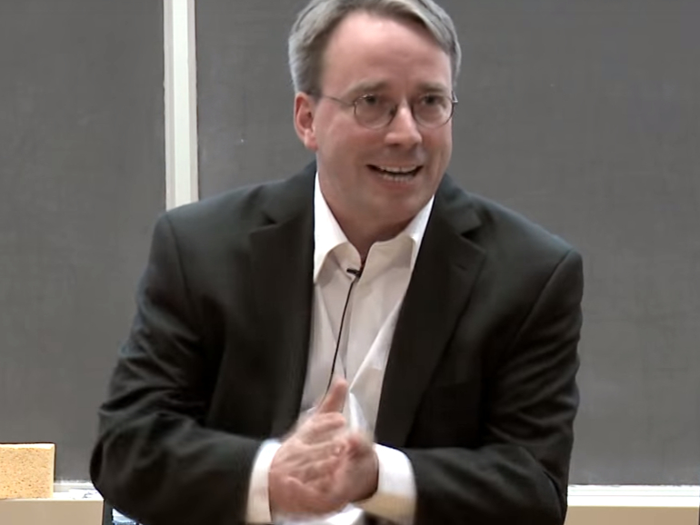

# Linux!

> Linux is a family of open-source Unix-like operating systems based on the Linux kernel, an *operating system kernel* first released on September 17, 1991, by **Linus Torvalds**.

**By Roozbeh Sharifnasab**
rsharifnasab@gmail.com

------------

# Linus Torvalds

+ Published Linux in 1991

+ Just for fun [book](http://linuxstory.ir/)

------------------

# why Linux? (Philosophy)
+ Free software vs Proprietary software?
+ why GNU/Linux?

https://en.wikipedia.org/wiki/GNU/Linux_naming_controversy

-------------------

# Free software's 4 Freedoms

+ The freedom to run the program as you wish, for any purpose.
+ The freedom to study how the program works, and change it, so it does your computing as you wish. Access to the source code is a precondition for this.
+ The freedom to redistribute copies, so you can help others.
+ The freedom to distribute copies of your modified versions to others.

https://www.gnu.org/philosophy/free-sw.en.html

-----------------

# Why Linux as a Desktop OS
+ ~47% of Professional Devs
+ Free
+ Customizable
+ Fast & Lightweight
+ Security? Privacy?
+ Gaming?

https://www.mygreatlearning.com/blog/linux-vs-windows/

--------------

# Why Linux as a Server OS
+ ~96.3% of servers
+ All top 500 super computers
+ Low-spec (cheap) servers
+ Security
+ Pricing

https://truelist.co/blog/linux-statistics/

-------------

# Other Unix-like OS
+ Android: Based on Linux kernel (by now)
+ BSD: allows commercialization
+ macOS: Darwin Kernel
+ PS4 kernel based on FreeBSD
+ Minix

--------------

# Distro
https://en.wikipedia.org/wiki/Linux_distribution

+ how to choose?
https://distrowatch.com/index.php

+ rolling vs fixed
https://fossbytes.com/rolling-release-vs-fixed-release-distros-which-linux-distributions-are-better/

--------------

# Distro parts

+ Bootloader (GRUB)
+ Kernel
+ Init system (System D, Runit, OpenRC)
+ Daemons (background services)
+ Graphical server (X Server)
+ Desktop environment (GNOME, Cinnamon, Mate, XFCE, KDE)
+ Applications

------------

# Terminal
+ Text-based
+ not interesting
+ and Shell?
https://fossbytes.com/difference-between-shell-console-terminal/
+ terminal emulator?
https://superuser.com/questions/96628/why-are-things-like-gnome-terminal-called-terminal-emulators-instead-of-just

-----------

# basic commands
+ pwd
+ cd
+ ls
+ cat
+ grep

https://dev.to/awwsmm/101-bash-commands-and-tips-for-beginners-to-experts-30je

https://www.educative.io/blog/bash-shell-command-cheat-sheet

----------

# SSH
+ why?
+ why not graphical?
+ users?

----------

# Edit files on terminal
+ vim
+ nano

---------

# File-system heirarchy

https://www.linuxfordevices.com/tutorials/linux/linux-filesystem-heirarchy

-----------

# Root?
+ a user. Why it is bad?
+ root of file system
---------------

# package managing

+ Install/Upgrade/Remove
+ Apt/Pacman/Yum
+ Software Repository

https://blog.packagecloud.io/apt-cheat-sheet/

-------------

# Sudo
+ a prefix for some commands? No
+ Sudoer accounts?
https://www.linuxfordevices.com/tutorials/linux/sudo-command-in-linux-unix

-----------

# get help
+ man
+ online man
https://www.man7.org/linux/man-pages/man1/uptime.1.html

+ TLDR

----------

# Bash scripting

syntax
https://learnxinyminutes.com/docs/bash/

---------

# compile from source
https://unix.stackexchange.com/questions/173/how-to-compile-and-install-programs-from-source

-----------

# for docker: glibc, alpine,
# bash scripting

------------------

Made with [Marp](https://marp.app/)
