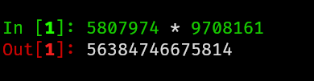
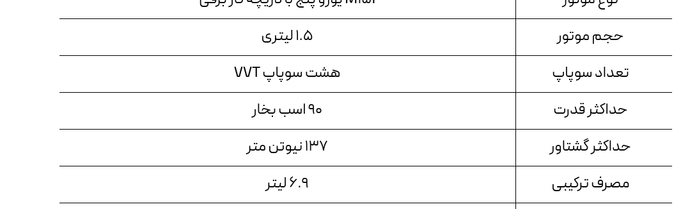

<style lang=css>

/* Theme source: https://github.com/rainbowflesh/Rose-Pine-For-Marp/tree/master/css */

@import "default";
@import "schema";
@import "structure";

:root {
    --base: #faf4ed;
    --surface: #fffaf3;
    --overlay: #f2e9e1;
    --muted: #9893a5;
    --subtle: #797593;
    --text: #575279;
    --love: #b4637a;
    --gold: #ea9d34;
    --rose: #d7827e;
    --pine: #286983;
    --foam: #56949f;
    --iris: #907aa9;
    --highlight-low: #f4ede8;
    --highlight-muted: #dfdad9;
    --highlight-high: #cecacd;

    font-family: Pier Sans, ui-sans-serif, system-ui, -apple-system,
        BlinkMacSystemFont, Segoe UI, Roboto, Helvetica Neue, Arial, Noto Sans,
        sans-serif, "Apple Color Emoji", "Segoe UI Emoji", Segoe UI Symbol,
        "Noto Color Emoji";
    font-weight: initial;

    background-color: var(--base);
}
/* Common style */
h1 {
    color: var(--rose);
    padding-bottom: 2mm;
    margin-bottom: 12mm;
}
h2 {
    color: var(--rose);
}
h3 {
    color: var(--rose);
}
h4 {
    color: var(--rose);
}
h5 {
    color: var(--rose);
}
h6 {
    color: var(--rose);
}
a {
    color: var(--iris);
}
p {
    font-size: 20pt;
    font-weight: 600;
    color: var(--text);
}
code {
    color: var(--text);
    background-color: var(--highlight-muted);
}
text {
    color: var(--text);
}
ul {
    color: var(--subtle);
}
li {
    color: var(--subtle);
}
img {
    background-color: var(--highlight-low);
}
strong {
    color: var(--text);
    font-weight: inherit;
    font-weight: 800;
}
mjx-container {
    color: var(--text);
}
marp-pre {
    background-color: var(--overlay);
    border-color: var(--highlight-high);
}

/* Code blok */
.hljs-comment {
    color: var(--muted);
}
.hljs-attr {
    color: var(--foam);
}
.hljs-punctuation {
    color: var(--subtle);
}
.hljs-string {
    color: var(--gold);
}
.hljs-title {
    color: var(--foam);
}
.hljs-keyword {
    color: var(--pine);
}
.hljs-variable {
    color: var(--text);
}
.hljs-literal {
    color: var(--rose);
}
.hljs-type {
    color: var(--love);
}
.hljs-number {
    color: var(--gold);
}
.hljs-built_in {
    color: var(--love);
}
.hljs-params {
    color: var(--iris);
}
.hljs-symbol {
    color: var(--foam);
}
.hljs-meta {
    color: var(--subtle);
}

</style>

# استفاده از مدل‌های بزرگ زبانی

> LLMها دسته‌ای از مدل‌های یادگیری ماشینی هستند که توانایی درک و تولید متنی شبیه انسان را دارند. این مدل‌ها این توانایی ها را با یادگیری روابط آماری از اسناد متنی در طی یک فرآیند آموزشی فشرده محاسباتی خود نظارت و نیمه نظارت به دست می آورند. آنها بر روی مجموعه داده‌های گسترده‌ای آموزش دیده‌اند که اغلب از اینترنت جمع‌آوری می‌شوند.

ارائه‌دهنده: روزبه شریف‌نسب
rsharifnasab@gmail.com

---

# هوش مصنوعی کلاسیک

-----------


-------


------------


---------------


----------


-----

# شبکه‌های عصبی 

+ الهام از مغز انسان
+ لایه‌های مختلف از نورون‌ها و اتصالات
+ فرایند یادگیری: مقداردهی نورون‌ها
+ تعداد لایه‌های زیاد: یادگیری عمیق
+ اجرای هزینه‌بر روی GPU

----


-----

# هوش مصنوعی مولد 

+ تولید به جای آنالیز
+ یادگیری بدون نظارت
+ جواب‌های متفاوت در هر اجرا
+ مبتنی بر Large Language Models یا Generative Adversarial Networks

------------------


-------------

# سایت «این شخص وجود ندارد»

https://thispersondoesnotexist.com/


----

# مدل بزرگ زبانی

+ یادگیری از روی مقدار زیادی متن
+ تولید متن طبیعی
+ پاسخ به سوالات
+ ورودی گرفتن *prompt*

----


----
# تست تورینگ

+ توسط Alen Turing در 1950
+ به هدف ارزیابی توانایی ماشین در تقلید انسان
+ به نام «بازی تقلید» مشهور است
+ یک انسان همزمان با یک ربات و یک انسان مکالمه می‌کند

-----

# درک LLM

+ تکمیل خودکار کیبورد گوشی
+ طوطی با حافظه‌ی زیاد 
+ اتاق چینی!


----


----

# چطور *prompt* خوب بنویسیم؟

+ توقع از «متن زبان طبیعی» به جای «استدلال»
+ حافظه‌ی ضعیف
+ توجه به دیتاست
+ توجه به فرمانبرداری مدل 
+ مثال‌های پرامپت‌های خوب و بد

---- 

# مثال از *prompt* خوب

+ خلاصه کردن متن
+ افزایش طول متن
+ پیشنهاد کلمه بر اساس توضیح
+ چک کردن اشکالات نگارشی
+ ترکیب چند متن 

-----

# مثال از *prompt* خوب - ادامه

+ پرسش و پاسخ (به شرط موجود بودن در اینترنت)
+ بررسی از دو دیدگاه
+ پرورش ایده
+ مقایسه ویژگی‌ها

---
# مثال از *prompt* خوب - ادامه

+ ریویوی کد
+ انتخاب اسم متغیر و پکیج
+ خلاصه کردن ارور


--------------

# مثال از *prompt* بد 

+ نوشتن متن وبلاگ (کپی‌رایت)
+ افشای اطلاعات محرمانه شرکت
+ سوال ریاضی
+ مشورت دارویی و تشخیص بیماری

---

# مثال از *prompt* بد - ادامه

+ نوشتن مقاله: نوآوری؟ ارجاع؟
+ نتیجه‌‌گیری و استدلال
+ موضوعاتی که در اینترنت وجود ندارد
+ ارائه اطلاعات به درد نخور (فرمانبرداری)
+ اشاره به جزئیات خیلی کم: مالیات چقدر است؟

---

# مثال از *prompt* بد - ادامه

+ داوری مقاله: صحت اطلاعات و نتیجه‌گیری
+ درخواست پیدا کردن مقاله
+ درخواست متن با ارجاع
+ در مورد احساسات و زیبایی و رنگ‌ها

---

# مثال از *prompt* بد - ادامه

+ نوشتن کد
+ دیباگ کد
+ حل کردن ارورها


---------


-----------




--------------


------------


-----------

+ چرا غلط جواب می‌دهد؟
+ چرا خودش نمی‌داند که غلط جواب می‌دهد؟
+ چرا جواب نزدیک است ولی درست نیست؟

----------


----------------------


------------------


------------------


-----------------

# دروغ‌گویی

+ نمی‌دانم؟
+ دانش‌آموز در زمان امتحان
+ دروغ با اعتماد به نفس بالا

-------------


---------


----------


-----

مشخصات تارا


----------

مشخصات اطلس


---
# چت‌های طولانی 

+ تکرار سوال و جواب قبلی در سوال بعدی
+ مشکل Hallucination
+ عدم امکان خواندن یا نوشتن **کتاب**

-----------------

# پشتیبانی از فارسی؟

+ اکثر مدل‌ها مثل Claude و ChatGPT
+ تولید آهسته‌تر و دقت کمتر (فرایند توکن‌سازی)
+ ترجمه بسیار بهتر از مترجم گوگل


-----------
# عملکرد در امتحان

+ ریاضی و فیزیک کنکور
+ دینی، عربی و ادبیات کنکور

-----------

# تشخیص متن AI-generated

+ معمولا قابل تشخیص است، حتی در انگلیسی
+ آبا می‌توان گفت «غیر قابل تشخیص بنویس»؟
+ خلاقیت و ایده بسیار کم
+ احساسات کم
+ نداشتن نظر
+ علاقه به bullet point
+ دانش غیر بروز

----------

# تشخیص متن AI-generated - ادامه 

+ تمایل به استفاده از کلمات و گرامرهای خاص

	+ not only - but also
	+ Insight
	+ Leverage
	+ Robust
	+ Streamline
	+ Seamless
	+ Disruptive

----
# ابزارهای هوشمند (با کمک LLM)

+ با کمک API call
+ مدل درآمدی؟
+ ترکیب با سرچ/خواندن فایل/یادداشت‌برداری

--------

# ابزارهای کاربردی با LLM

+ ابزار رایگان perplexity
+ ابزار رایگان notebooklm گوگل
+ سایت poe.com 
+ سایت popai.pro
+ سایت gamma.app
+ سایت typeset.io

---------


-----------------


--------


-------


----------

# استفاده از API

+ هزینه کمتر نسبت به خرید اشتراک (هر پیام ۵۰۰ تومن!)
+ قیمت گذاری بر اساس تعداد توکن ورودی و خروجی
+ طولانی شدن چت -> بیشتر شدن هزینه 

---

# اپلیکیشن‌هایی برای استفاده از API

+ Lobchat (le-ai.app)
+ Openrouter.ai (Web)
+ Typingmind (Web)
+ Jan (PC)
+ ChatBox (Web, Android, iOS)
+ OpenCat (iOS)
+ Macmind (macOS)
+ Mods (terminal)

----

# تولید تصویر

+ بسیار پر هزینه 
+ عدم رعایت جزئیات 
+ عدم امکان اضافه کردن متن
+ استفاده‌های خلاقانه

---------


-----------------

# مدل‌های با استدلال

+ مدل O1 شرکت open ai
+ فوق‌العاده گران 
+ پیدا کردن مرحله به مرحله‌ی راه حل 
+ نهایتا ۵-۶ مرحله استدلال
+ هنوز برای محاسبات ریاضی مناسب نیست

-------

# با تشکر از شما!

---

ساخته شده توسط [Marp](https://marp.app/)

+ برای اجرا می‌توان از این دستور استفاده کرد:
```bash
marp README.md --allow-local-files -w
```
