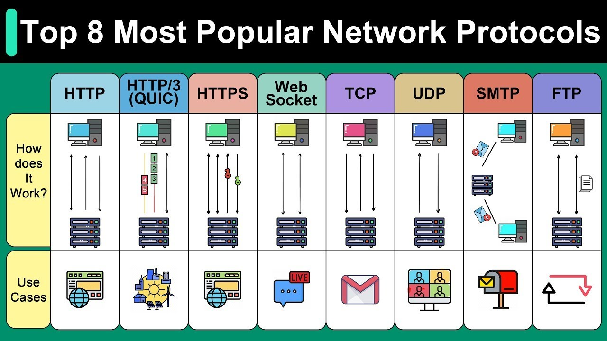
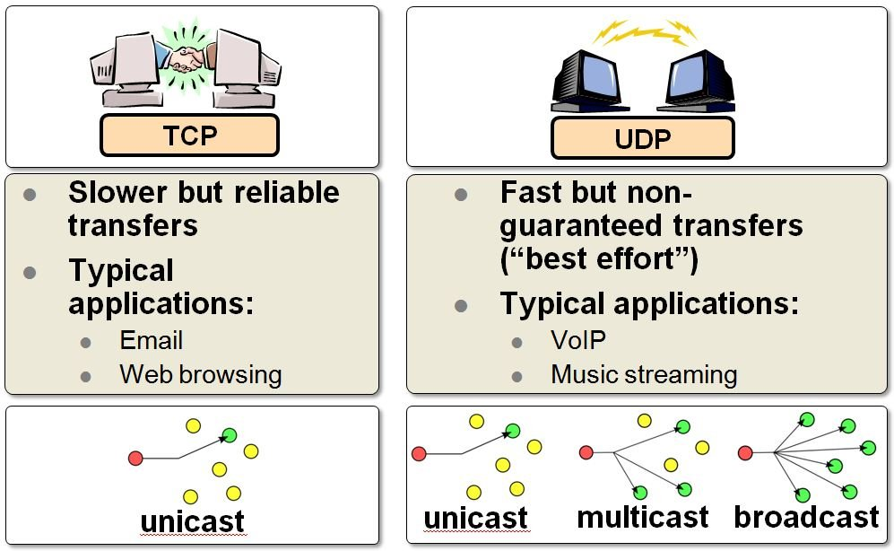
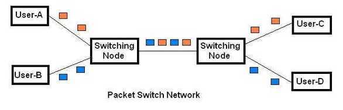
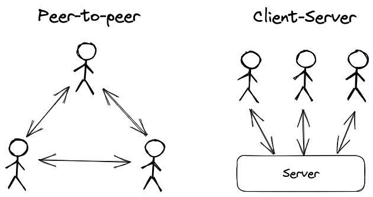

<style lang=css>

/* Theme source: https://github.com/rainbowflesh/Rose-Pine-For-Marp/tree/master/css */

@import "default";
@import "schema";
@import "structure";

:root {
    --base: #faf4ed;
    --surface: #fffaf3;
    --overlay: #f2e9e1;
    --muted: #9893a5;
    --subtle: #797593;
    --text: #575279;
    --love: #b4637a;
    --gold: #ea9d34;
    --rose: #d7827e;
    --pine: #286983;
    --foam: #56949f;
    --iris: #907aa9;
    --highlight-low: #f4ede8;
    --highlight-muted: #dfdad9;
    --highlight-high: #cecacd;

    font-family: Pier Sans, ui-sans-serif, system-ui, -apple-system,
        BlinkMacSystemFont, Segoe UI, Roboto, Helvetica Neue, Arial, Noto Sans,
        sans-serif, "Apple Color Emoji", "Segoe UI Emoji", Segoe UI Symbol,
        "Noto Color Emoji";
    font-weight: initial;

    background-color: var(--base);
}
/* Common style */
h1 {
    color: var(--rose);
    padding-bottom: 2mm;
    margin-bottom: 12mm;
}
h2 {
    color: var(--rose);
}
h3 {
    color: var(--rose);
}
h4 {
    color: var(--rose);
}
h5 {
    color: var(--rose);
}
h6 {
    color: var(--rose);
}
a {
    color: var(--iris);
}
p {
    font-size: 20pt;
    font-weight: 600;
    color: var(--text);
}
code {
    color: var(--text);
    background-color: var(--highlight-muted);
}
text {
    color: var(--text);
}
ul {
    color: var(--subtle);
}
li {
    color: var(--subtle);
}
img {
    background-color: var(--highlight-low);
}
strong {
    color: var(--text);
    font-weight: inherit;
    font-weight: 800;
}
mjx-container {
    color: var(--text);
}
marp-pre {
    background-color: var(--overlay);
    border-color: var(--highlight-high);
}

/* Code blok */
.hljs-comment {
    color: var(--muted);
}
.hljs-attr {
    color: var(--foam);
}
.hljs-punctuation {
    color: var(--subtle);
}
.hljs-string {
    color: var(--gold);
}
.hljs-title {
    color: var(--foam);
}
.hljs-keyword {
    color: var(--pine);
}
.hljs-variable {
    color: var(--text);
}
.hljs-literal {
    color: var(--rose);
}
.hljs-type {
    color: var(--love);
}
.hljs-number {
    color: var(--gold);
}
.hljs-built_in {
    color: var(--love);
}
.hljs-params {
    color: var(--iris);
}
.hljs-symbol {
    color: var(--foam);
}
.hljs-meta {
    color: var(--subtle);
}

</style>


# Computer Networking basics

> A computer network is a set of computers sharing resources located on or provided by network nodes. Computers use common communication protocols over digital interconnections to communicate with each other.

**By Roozbeh Sharifnasab**
rsharifnasab@gmail.com

---

# Why?

+ Clients connect through the network.
+ Other services connect through the network.
+ Optimization, load balancing, and security.

---


---


---


---


---


---



---


---


---


---


---


---

# Q/A

---

# IP

---


---


---


---


---


---


---


---


---


---

# Hands-on

+ ping
+ traceroute/mtr
+ nslookup/dig
+ ip (command)

---


# Q/A

---

# Layered model


---


---

# OSI model

https://www.cloudflare.com/learning/ddos/glossary/open-systems-interconnection-model-osi/

---

# TCP/IP model

https://www.javatpoint.com/computer-network-tcp-ip-model

---


---


---


---


---


---


---



---


---

# Q/A

---

# Circuit switched network vs Packet switched network

---


---



---


---

# Client/Server Vs Peer to Peer

---


---



---

Made with [Marp](https://marp.app/)

+ run with:
```bash
marp README.md --allow-local-files -w
```
