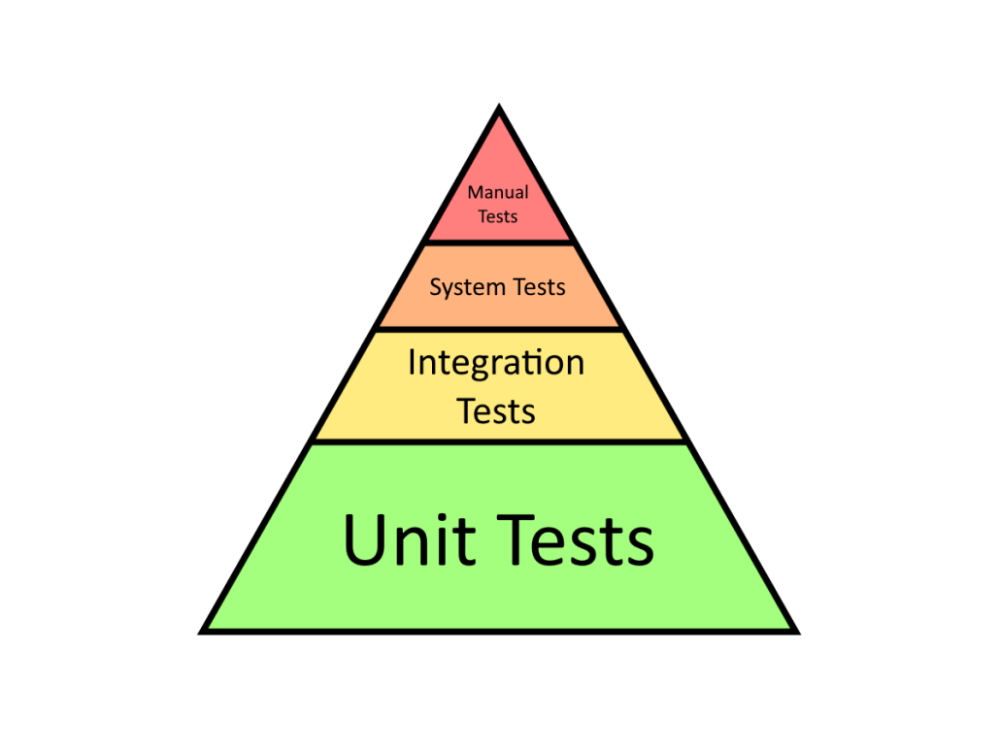

# Testing!

> Software testing is the act of examining the artifacts and the behavior of the software under test by validation and verification.

**By Roozbeh Sharifnasab**
rsharifnasab@gmail.com

------------

# What is testing?

------------

# Why testing?

+ Industry?
+ Metropol...

-----------

# Why testing (Software)

+ X-ray device killed people
+ Aiane 5 Flight 501 (1996)

------------

------------

# Testing method

+ Traditional:
    + Entrepreneur!
    + Print output
    + Check manually

+ Automatic:
    + Re-usable
    + Fast
    + Accurate

------------------

------------------

# What about tester?

+ Should Tester test our code?

------------------

# Unit test

------------------

# Test Driven Development
+ Red-Green-Refactor
+ Don't write new code unless you have a failing test
+ Write simplest code possible to pass the test

-------------------

----------------

# Test coverage

--------------

-------------

---------------

# Other kind of test
+ Integration test
+ System test
+ Acceptance test
+ Fuzz test
+ Load test (Non-functional)

--------------

--------------

---------------

# Good Test
+ Clean
+ Automated
+ Fast?
+ Repeatable
+ Independent

--------------

# What to test

---------------

--------------

# DevOps
+ Development + Operation
+ Reduce time between committing a change and put change to production
+ CI/CD pipeline

--------------

+ Canary test
+ A/B test
+ Staging Environment

---------------

Made with [Marp](https://marp.app/)
